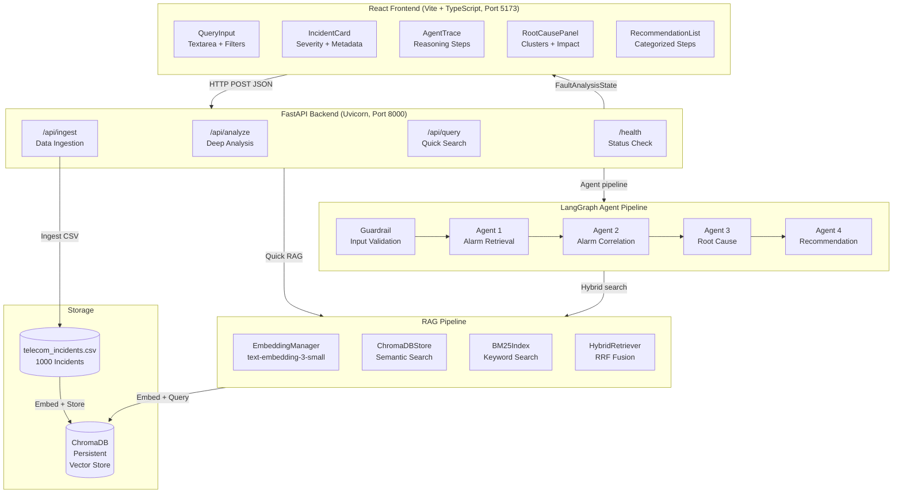
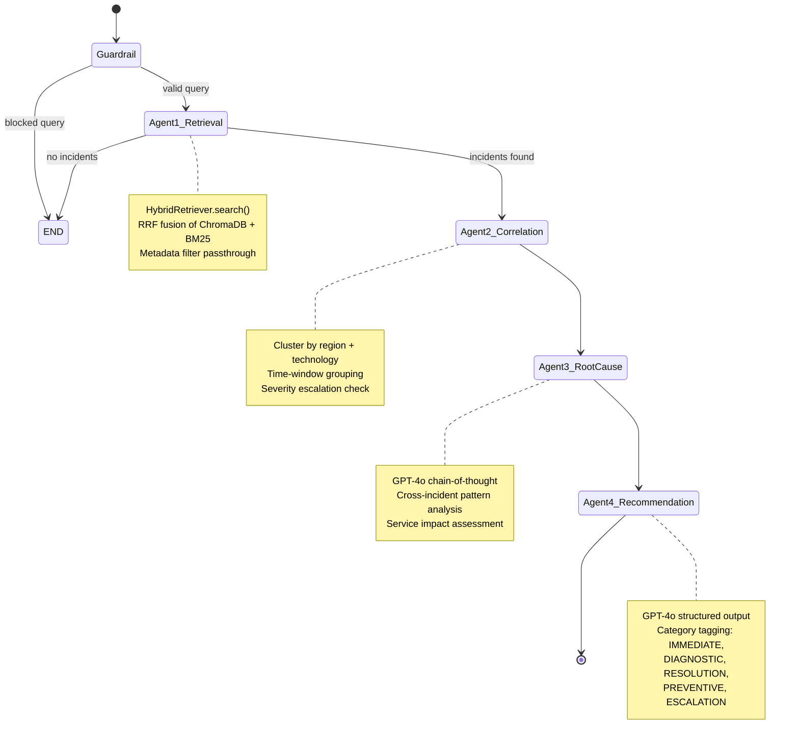

# Architecture: TelecomNetworkFaultIntel

## System Architecture Diagram



## LangGraph Workflow



## Data Flow

### Ingestion Flow

```
CSV File (1000 rows)
  → IngestionPipeline.ingest_csv()
  → pandas DataFrame
  → Per-row text construction: "alarm_id | description | region | technology | severity | vendor | resolution"
  → EmbeddingManager.embed_texts() → OpenAI text-embedding-3-small API
  → ChromaDBStore.add_documents() → ChromaDB collection "telecom_incidents"
  → BM25Index.build() → in-memory BM25 index
```

### Query Flow (Quick Search)

```
User Query + Filters
  → POST /api/query
  → Guardrail check (keyword + LLM validation)
  → HybridRetriever.search(query, k, filters)
      ├── EmbeddingManager.embed_texts([query]) → query vector
      ├── ChromaDBStore.similarity_search(query_vec, k*2, filters) → semantic results
      ├── BM25Index.search(query, k*2) → keyword results
      └── RRF fusion: score = Σ 1/(rank_i + 60) → top-k merged
  → Quick LLM root cause suggestion
  → QueryResponse JSON → Frontend
```

### Analysis Flow (Deep Analysis)

```
User Query + Filters
  → POST /api/analyze
  → LangGraph.invoke(FaultAnalysisState)
      ├── Node: Guardrail → validate/flag query
      ├── Node: Agent1 → HybridRetriever → retrieved_incidents[]
      ├── Node: Agent2 → cluster by (region, technology, time window)
      │                → correlated_alarms[], severity_escalated flag
      ├── Node: Agent3 → GPT-4o(incidents + clusters) → root_cause, service_impact
      └── Node: Agent4 → GPT-4o(root_cause + context) → recommendations[]
  → AnalysisResponse JSON (includes reasoning_trace[]) → Frontend
```

## Component Descriptions

### Backend

| Component | File | Responsibility |
|---|---|---|
| FastAPI App | `backend/app/main.py` | Route definitions, CORS, lifespan events |
| Settings | `backend/app/config.py` | pydantic-settings, env var loading |
| FaultAnalysisState | `backend/app/models/agent_state.py` | TypedDict shared across all LangGraph nodes |
| EmbeddingManager | `backend/app/rag/embeddings.py` | Batched embedding calls to OpenAI |
| ChromaDBStore | `backend/app/rag/vectorstore.py` | ChromaDB collection wrapper, metadata filtering |
| BM25Index | `backend/app/rag/bm25_index.py` | rank_bm25 wrapper, tokenization |
| HybridRetriever | `backend/app/rag/hybrid_retriever.py` | RRF fusion of semantic + keyword results |
| IngestionPipeline | `backend/app/rag/ingestion.py` | CSV parsing, text construction, batch embed + store |
| LangGraph | `backend/app/agents/graph.py` | StateGraph definition, node wiring, compilation |
| Agent 1 | `backend/app/agents/agent1_retrieval.py` | Invokes HybridRetriever, populates retrieved_incidents |
| Agent 2 | `backend/app/agents/agent2_correlation.py` | Groups incidents into CorrelationCluster dicts |
| Agent 3 | `backend/app/agents/agent3_rootcause.py` | GPT-4o root cause reasoning |
| Agent 4 | `backend/app/agents/agent4_recommendation.py` | GPT-4o recommendation generation |

### Frontend

| Component | File | Responsibility |
|---|---|---|
| App | `src/App.tsx` | Root layout, health polling, state management |
| QueryInput | `src/components/QueryInput.tsx` | Search textarea, filter dropdowns, API dispatch |
| IncidentCard | `src/components/IncidentCard.tsx` | Single incident with severity badge, collapsible notes |
| AgentTrace | `src/components/AgentTrace.tsx` | Color-coded accordion of LangGraph reasoning steps |
| RootCausePanel | `src/components/RootCausePanel.tsx` | Root cause, service impact, correlation clusters |
| RecommendationList | `src/components/RecommendationList.tsx` | Categorized recommendations with copy-to-clipboard |
| API Client | `src/api/client.ts` | axios wrapper for all backend endpoints |
| Types | `src/types/index.ts` | TypeScript interfaces matching FastAPI response models |

## Key Architectural Decisions

1. **Stateless backend, stateful LangGraph**: The FastAPI handlers are stateless (no per-session state); the LangGraph StateGraph accumulates state within a single analysis run via the `FaultAnalysisState` TypedDict.

2. **Vite proxy**: The frontend dev server proxies `/api` and `/health` to `localhost:8000`, allowing a single-origin development setup without CORS issues.

3. **RRF constant k=60**: The standard Reciprocal Rank Fusion formula `1/(rank + 60)` was chosen based on the original RRF paper (Cormack et al., 2009), which found k=60 to be robust across diverse retrieval systems.

4. **ChromaDB collection isolation**: The collection name `telecom_incidents` is hardcoded in `ChromaDBStore`, ensuring ingestion and retrieval always target the same collection even if `CHROMA_PERSIST_DIR` changes.
