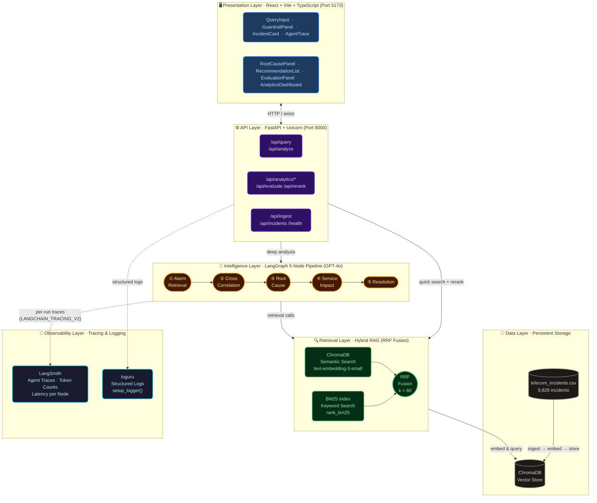
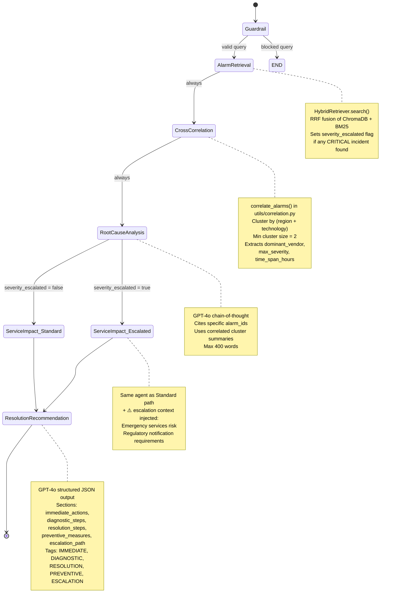
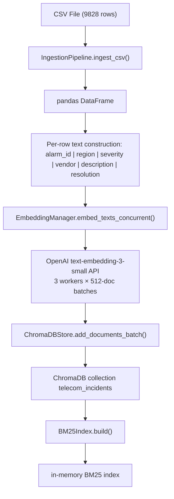
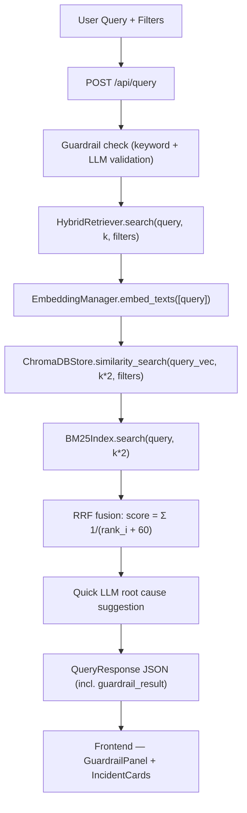
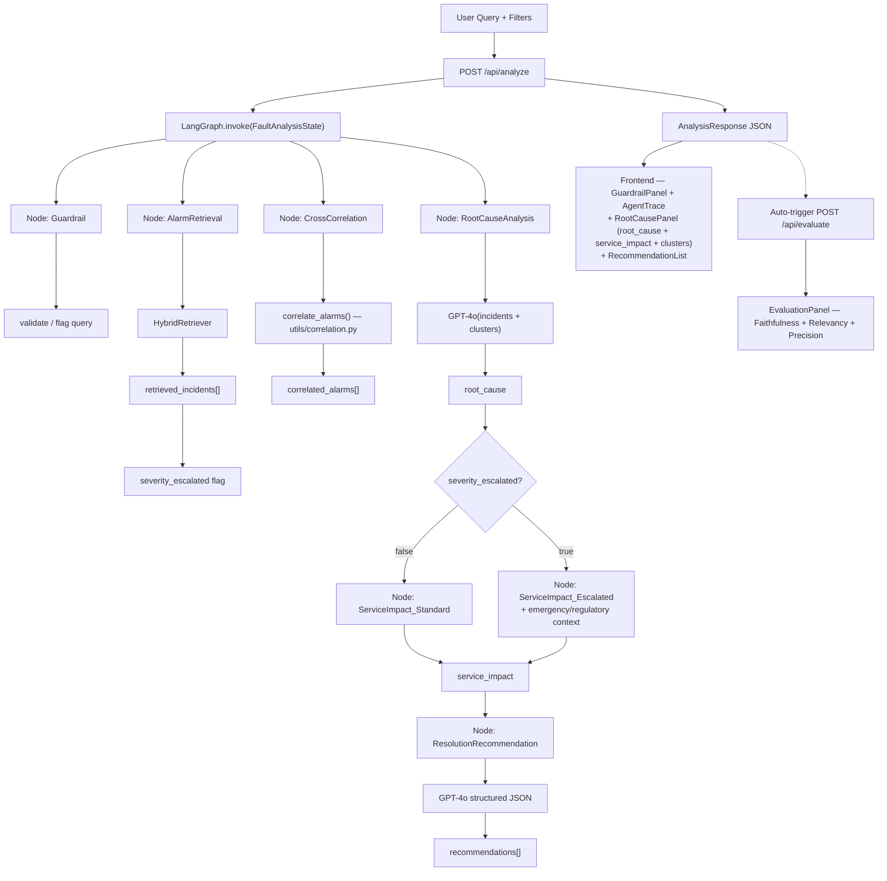
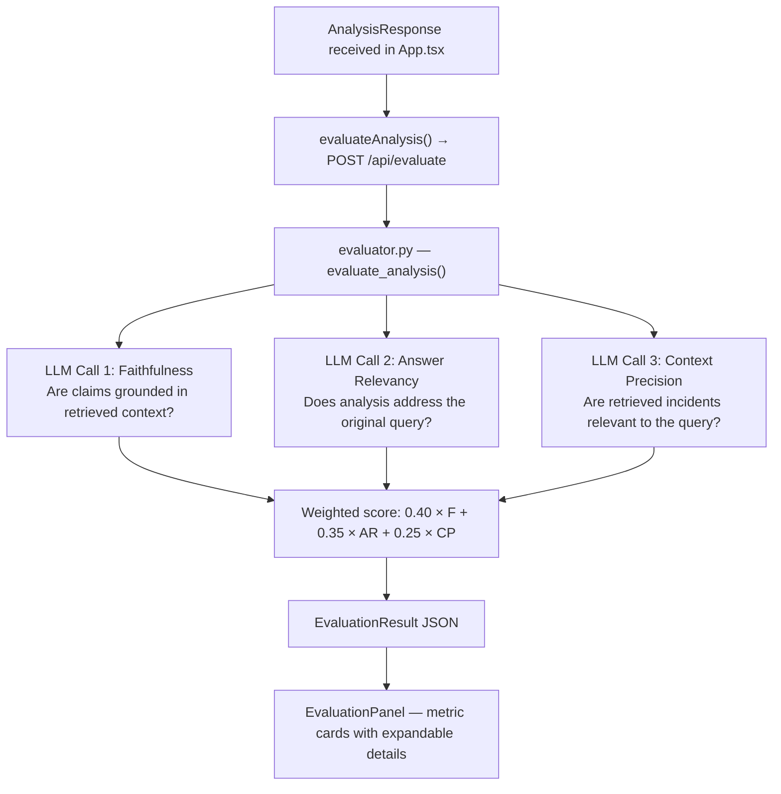

# Architecture: FaultSense AI

## System Architecture Diagram

## LangGraph Workflow

## Data Flow

### Ingestion Flow

### Query Flow (Quick Search)

### Analysis Flow (Deep Analysis)

### Evaluation Flow (Auto-triggered after Deep Analysis)

## Component Descriptions

### Backend

| Component | File | Responsibility |
|---|---|---|
| FastAPI App | `backend/app/main.py` | Route definitions, CORS, lifespan events, LangSmith bootstrap |
| Settings | `backend/app/config.py` | pydantic-settings, env var loading, OpenAI client factory |
| FaultAnalysisState | `backend/app/models/agent_state.py` | TypedDict shared across all LangGraph nodes (incl. `service_impact`) |
| Incident Model | `backend/app/models/incident.py` | Pydantic model for incident records |
| LangGraph Workflow | `backend/app/graph/workflow.py` | StateGraph definition, 5 nodes, escalation conditional edge |
| Node 1: Alarm Retrieval | `backend/app/agents/alarm_retrieval_agent.py` | Hybrid search, `severity_escalated` flag |
| Node 3: Root Cause | `backend/app/agents/root_cause_agent.py` | GPT-4o RCA with alarm ID citations |
| Node 4: Service Impact | `backend/app/agents/service_impact_agent.py` | Blast radius, SLA risk, cascading failures; escalation context injection |
| Node 5: Resolution | `backend/app/agents/resolution_agent.py` | Structured JSON remediation steps |
| Correlation Utility | `backend/app/utils/correlation.py` | `correlate_alarms()` — deterministic region+tech clustering |
| Guardrails | `backend/app/utils/guardrails.py` | Two-layer input validation (keyword + LLM classifier) |
| Logger | `backend/app/utils/logger.py` | loguru `setup_logger()` |
| EmbeddingManager | `backend/app/rag/embeddings.py` | Concurrent batched OpenAI embedding calls |
| ChromaDBStore | `backend/app/rag/vectorstore.py` | ChromaDB collection wrapper, metadata filtering |
| BM25Index | `backend/app/rag/bm25_index.py` | rank_bm25 wrapper, tokenization |
| HybridRetriever | `backend/app/rag/hybrid_retriever.py` | RRF fusion of semantic + keyword results |
| IngestionPipeline | `backend/app/rag/ingestion.py` | CSV parsing, text construction, batch embed + store |
| Evaluator | `backend/app/evaluation/evaluator.py` | Direct LLM-as-judge: Faithfulness, Answer Relevancy, Context Precision + cross-encoder reranker |
| Predictor | `backend/app/prediction/predictor.py` | Deterministic pattern mining + LLM narrative forecast |

### Frontend

| Component | File | Responsibility |
|---|---|---|
| App | `src/App.tsx` | 4-mode routing (query/analyze/dashboard/evaluate), health polling, auto-eval trigger |
| QueryInput | `src/components/QueryInput.tsx` | Search textarea, filter dropdowns, API dispatch |
| IncidentCard | `src/components/IncidentCard.tsx` | Single incident with severity badge, collapsible resolution notes |
| GuardrailPanel | `src/components/GuardrailPanel.tsx` | 3-check validation display (Input Validation, Injection Detection, Telecom Relevance) |
| AgentTrace | `src/components/AgentTrace.tsx` | Color-coded accordion of LangGraph reasoning steps |
| RootCausePanel | `src/components/RootCausePanel.tsx` | Root cause narrative + service impact + correlated alarm clusters |
| RecommendationList | `src/components/RecommendationList.tsx` | Categorized recommendations with copy-to-clipboard |
| AnalyticsDashboard | `src/components/AnalyticsDashboard.tsx` | KPIs, severity/tech/vendor charts, 30-day sparkline, predictive forecast |
| EvaluationPanel | `src/components/EvaluationPanel.tsx` | RAGAS metric cards with expandable "what this measures" / "high/low score means" panels |
| ErrorBoundary | `src/components/ErrorBoundary.tsx` | Class component catching render-phase errors; fallback UI with "Try again" |
| API Client | `src/api/client.ts` | axios wrapper for all backend endpoints |
| Types | `src/types/index.ts` | TypeScript interfaces (Incident, AnalysisResponse, EvaluationResult, GuardrailResult, …) |

## Key Architectural Decisions

1. **5-node pipeline with escalation fork**: Service impact is a dedicated node (not merged into root cause) because blast-radius analysis and causal reasoning require distinct system prompts and expertise. The conditional edge routes CRITICAL faults to an escalation-aware service impact node that injects emergency services and regulatory context.

2. **Correlation extracted to `utils/`**: `correlate_alarms()` is a pure deterministic function with no LLM dependency. Placing it in `utils/correlation.py` rather than `agents/` signals its nature and makes it independently unit-testable.

3. **Auto-evaluation after Deep Analysis**: `App.tsx` triggers `evaluateAnalysis()` immediately after every analysis result arrives. This gives engineers a quality signal (faithfulness, relevancy, precision) without a manual step. Evaluation failure is non-critical — the analysis result is still shown.

4. **Direct LLM-as-judge (not DeepEval built-ins)**: Each RAGAS metric is a single focused LLM call whose expected JSON response is under 300 tokens. DeepEval's built-in metric objects make multiple sequential internal LLM calls that exceed proxy `max_tokens=500` caps. The `_extract_json()` helper strips code fences and prose before parsing.

5. **GuardrailPanel shown always**: The `GuardrailPanel` renders before results in both Query Mode and Deep Analysis mode. When a query is blocked, pipeline results are hidden — engineers cannot act on a blocked query. When warnings are present, results are shown but the warning is visible.

6. **Stateless backend, stateful LangGraph**: The FastAPI handlers are stateless (no per-session state); the LangGraph StateGraph accumulates state within a single analysis run via the `FaultAnalysisState` TypedDict.

7. **Vite proxy**: The frontend dev server proxies `/api` and `/health` to `localhost:8000`, allowing a single-origin development setup without CORS issues.

8. **LangSmith bootstrap in `main.py`**: LangSmith environment variables are set via `os.environ` before any LangChain/LangGraph module is imported, because `langchain_core.tracers` reads `os.environ` at import time. This is a required ordering constraint.

9. **RRF constant k=60**: The standard Reciprocal Rank Fusion formula `1/(rank + 60)` was chosen based on the original RRF paper (Cormack et al., 2009), which found k=60 to be robust across diverse retrieval systems.

10. **ChromaDB collection isolation**: The collection name `telecom_incidents` is stored in `Settings.CHROMA_COLLECTION`, ensuring ingestion and retrieval always target the same collection even if `CHROMA_PERSIST_DIR` changes.
