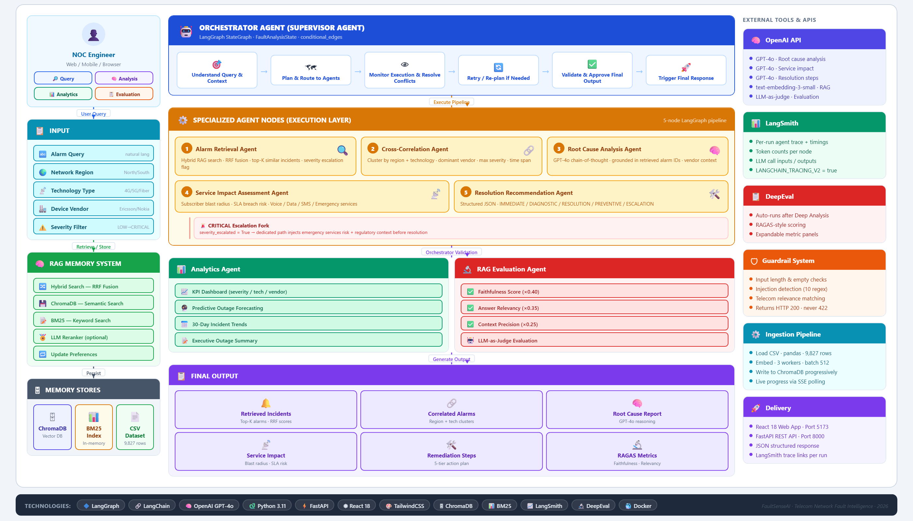

# FaultSense AI — Telecom Network Fault Intelligence Assistant

An AI-powered telecom network fault intelligence platform combining **Retrieval-Augmented Generation (RAG)** with a **LangGraph multi-agent pipeline** to analyze network incidents, identify root causes, assess service impact, correlate alarms, and generate actionable remediation recommendations — wrapped in a polished dark-mode React UI with glassmorphism design.

---

## Table of Contents

1. [Overview](#1-overview)
2. [Features](#2-features)
3. [Architecture](#3-architecture)
4. [Tech Stack](#4-tech-stack)
5. [Quick Start](#5-quick-start)
   - [Prerequisites](#51-prerequisites)
   - [Setup](#52-setup)
   - [Running the App](#53-running-the-app)
6. [API Reference](#6-api-reference)
7. [UI Modes & Components](#7-ui-modes--components)
8. [Project Structure](#8-project-structure)
9. [Environment Variables](#9-environment-variables)
10. [Design Decisions](#10-design-decisions)

---

## 1. Overview

Telecom NOC teams face hundreds of alarms per hour. This platform provides:

- **Instant retrieval** of semantically similar historical incidents using hybrid RAG (ChromaDB + BM25 + RRF)
- **5-node LangGraph pipeline** that traces raw alarms → root cause → service impact → remediation, with a conditional CRITICAL escalation fork
- **Live pipeline status display** — animated step-by-step progress shown during every search and analysis operation
- **Analytics dashboard** with real-time KPIs, 30-day severity trends, and AI-generated outage forecasts
- **RAGAS-style evaluation metrics** (Faithfulness, Answer Relevancy, Context Precision) auto-computed after every deep analysis
- **Two-layer guardrail validation** with a visual 3-check panel for every query
- **Premium dark-mode UI** with glassmorphism cards, severity-glow incident cards, timeline agent trace, and gradient navigation

---

## 2. Features

| Feature | Description |
|---|---|
| **Hybrid RAG Search** | ChromaDB semantic search + BM25 keyword search fused via Reciprocal Rank Fusion (RRF, k=60) |
| **5-Node LangGraph Pipeline** | Alarm Retrieval → Cross-Correlation → Root Cause → Service Impact (escalation fork) → Resolution |
| **Live Pipeline Status** | Animated step-by-step progress display (StatusDisplay) during Quick Search and Deep Analysis |
| **Alarm Correlation** | Deterministic clustering by region + technology; extracts dominant vendor, max severity, time span |
| **Root Cause Analysis** | GPT-4o chain-of-thought reasoning grounded in retrieved incident alarm IDs |
| **Service Impact Assessment** | Subscriber blast radius, SLA breach risk, cascading failure paths; Voice / Data / SMS / Emergency services |
| **CRITICAL Escalation Fork** | CRITICAL incidents route to a dedicated path that injects emergency services risk and regulatory context |
| **Resolution Recommendations** | Structured JSON output: IMMEDIATE / DIAGNOSTIC / RESOLUTION / PREVENTIVE / ESCALATION |
| **Analytics Dashboard** | KPI cards, severity distribution, technology/vendor breakdowns, 30-day trend sparkline |
| **Predictive Intelligence** | Pattern mining (hotspots, vendor failures, peak hours) → LLM risk forecast |
| **RAGAS Evaluation (Auto)** | LLM-as-Judge: Faithfulness (×0.40), Answer Relevancy (×0.35), Context Precision (×0.25) — auto-runs after every deep analysis |
| **Guardrail Panel** | Visual 3-check validation: Input Validation · Injection Detection · Telecom Relevance |
| **LLM Reranking** | Cross-encoder LLM judge blended with RRF scores (0.6×judge + 0.4×rrf) |
| **Automated Summarization** | Executive outage summary reports from filtered incident sets |
| **LangSmith Tracing** | Optional per-run agent traces, token counts, and latency breakdowns |
| **Fast Ingestion** | Concurrent embedding (3 workers × 512-doc batches) with live SSE progress tracking |
| **Glassmorphism UI** | Backdrop-blur cards, severity-specific glow shadows, gradient text, ambient background glows |
| **Timeline Agent Trace** | Vertical timeline layout with numbered circles, per-agent color themes, and expand/collapse |
| **Frontend Error Resilience** | React ErrorBoundary prevents full-page blank on component crash |

---

## 3. Architecture



> **Full interactive diagram:** open [ARCHITECTURE.html](./ARCHITECTURE.html) in a browser — zoomable, print-ready, and exportable as PNG.

### LangGraph Pipeline Flow

| Step | Agent | Description |
|---|---|---|
| 🛡 | **Guardrail Validation** | Two-layer check: input length/format → injection detection → telecom relevance |
| 1 | **Alarm Retrieval Agent** | Hybrid RAG — ChromaDB semantic + BM25 keyword fused via RRF (k=60); sets severity escalation flag |
| 2 | **Cross-Correlation Agent** | Deterministic clustering by region + technology; extracts dominant vendor, max severity, time span |
| 3 | **Root Cause Analysis Agent** | GPT-4o chain-of-thought reasoning grounded in retrieved alarm IDs and vendor context |
| 4 | **Service Impact Agent** | Subscriber blast radius, SLA breach risk, cascading failures; CRITICAL fork adds emergency/regulatory context |
| 5 | **Resolution Agent** | Structured JSON remediation — IMMEDIATE / DIAGNOSTIC / RESOLUTION / PREVENTIVE / ESCALATION |

---

## 4. Tech Stack

| Layer | Technology |
|---|---|
| **Backend API** | FastAPI + Uvicorn (Python 3.11+) |
| **Agent Orchestration** | LangGraph + LangChain |
| **LLM** | OpenAI GPT-4o (configurable) |
| **Embeddings** | OpenAI text-embedding-3-small (1536 dims) |
| **Vector Store** | ChromaDB (persistent local, `./chroma_db/`) |
| **Keyword Search** | rank_bm25 (in-memory, rebuilt on each ingest) |
| **Data Processing** | pandas, numpy |
| **Configuration** | pydantic-settings + python-dotenv |
| **Observability** | loguru + optional LangSmith tracing |
| **Frontend** | Vite + React 18 + TypeScript |
| **Styling** | TailwindCSS v3 (dark theme, glassmorphism) |
| **Icons** | lucide-react |
| **HTTP Client** | axios (120 s timeout) |
| **Evaluation** | deepeval (RAGAS-style LLM-as-judge) |

---

## 5. Quick Start

### 5.1 Prerequisites

- Python 3.11 or higher
- Node.js 18 or higher
- An OpenAI API key with access to `gpt-4o` and `text-embedding-3-small`
- ~500 MB free disk space for ChromaDB persistence

### 5.2 Setup

**Clone and configure:**

```bash
cp .env.example .env
# Edit .env — set OPENAI_API_KEY (and OPENAI_BASE_URL if using a proxy)
```

**Python environment:**

```bash
python -m venv .venv

# Windows:
.venv\Scripts\activate
# macOS/Linux:
source .venv/bin/activate

pip install -r requirements.txt
```

**Frontend dependencies:**

```bash
cd frontend
npm install
```

### 5.3 Running the App

**Start the backend:**

```bash
uvicorn backend.app.main:app --reload --port 8000
```

**Start the frontend** (new terminal):

```bash
cd frontend
npm run dev
# Opens at http://localhost:5173
```

**Ingest data** (first-time or to refresh):

Click the **database icon** in the top-right of the UI — the animated progress bar tracks each ingestion step in real time. Typically completes in **12–15 seconds** with concurrent embedding (3 workers, 512-doc batches).

Or trigger via API:

```bash
curl -X POST http://localhost:8000/api/ingest
```

**Access points:**

| URL | Purpose |
|---|---|
| `http://localhost:5173` | React UI |
| `http://localhost:8000/docs` | Swagger API documentation |
| `http://localhost:8000/health` | Health check + indexed document count |

---

## 6. API Reference

### Core

| Method | Endpoint | Description |
|---|---|---|
| `GET` | `/health` | System health and ChromaDB document count |
| `GET` | `/api/incidents` | List incidents with filters (region, severity, vendor, technology) |
| `POST` | `/api/ingest` | Trigger CSV → ChromaDB + BM25 ingestion |
| `GET` | `/api/ingest/status` | Live ingestion progress (step, percent, docs done/total) |

### Search & Analysis

| Method | Endpoint | Description |
|---|---|---|
| `POST` | `/api/query` | Hybrid RAG search + quick LLM root cause suggestion + guardrail result |
| `POST` | `/api/analyze` | Full 5-node LangGraph pipeline — reasoning trace, service impact, correlation clusters, remediation |

### Analytics & Intelligence

| Method | Endpoint | Description |
|---|---|---|
| `GET` | `/api/analytics/summary` | Aggregate KPIs: severity distribution, tech/vendor breakdown, top regions, avg outage duration |
| `GET` | `/api/analytics/trends` | Daily incident counts for last N days (default 30), broken down by severity |
| `POST` | `/api/analytics/predict` | Predictive outage intelligence: pattern mining → LLM risk forecast |
| `POST` | `/api/summarize` | Automated executive outage summary from a filtered incident set |
| `POST` | `/api/evaluate` | RAGAS-style LLM-as-Judge: Faithfulness, Answer Relevancy, Context Precision |
| `POST` | `/api/rerank` | Cross-encoder LLM reranking of retrieved incidents |

### Request/Response Examples

**Quick Search:**

```bash
curl -X POST http://localhost:8000/api/query \
  -H "Content-Type: application/json" \
  -d '{
    "query": "5G call drops in North region during peak hours",
    "filters": {"severity": "HIGH"},
    "top_k": 5
  }'
```

**Deep Analysis:**

```bash
curl -X POST http://localhost:8000/api/analyze \
  -H "Content-Type: application/json" \
  -d '{
    "query": "Ericsson RRU hardware failure causing LTE service outage",
    "filters": {"technology_type": "4G LTE"},
    "top_k": 10
  }'
```

**Predictive Forecast:**

```bash
curl -X POST http://localhost:8000/api/analytics/predict \
  -H "Content-Type: application/json" \
  -d '{"region": "North", "technology": "5G"}'
```

**Filter Incidents:**

```bash
curl "http://localhost:8000/api/incidents?severity=CRITICAL&network_region=North&page_size=20"
```

---

## 7. UI Modes & Components

### Navigation Tabs

The header contains a pill-style tab bar with gradient active states:

| Mode | Gradient | Description |
|---|---|---|
| **Query Mode** | Blue | Natural language search — shows StatusDisplay progress, GuardrailPanel, severity-glow incident cards with relevance bars |
| **Deep Analysis** | Violet | Full 5-node LangGraph pipeline — animated StatusDisplay, timeline AgentTrace, GuardrailPanel, RootCausePanel, RecommendationList |
| **Analytics** | Teal | KPI cards, severity distribution pie, technology/vendor bar charts, 30-day trend sparkline, AI predictive forecast |
| **Evaluation** | Purple | RAGAS metrics (Faithfulness, Answer Relevancy, Context Precision) auto-run after every deep analysis; expandable per-metric panels |

### Key UI Components

| Component | Description |
|---|---|
| **StatusDisplay** | Animated step-by-step pipeline progress — shows each agent stage with a running spinner, progress bar, and per-step sublabel. Quick Search shows 4 steps; Deep Analysis shows 6 steps. |
| **IncidentCard** | Glassmorphism card with severity-specific ambient glow, icon-annotated chips (region/tech/vendor), gradient relevance fill bar, and hover lift animation |
| **AgentTrace** | Vertical timeline with colored numbered circles, per-agent emoji + color theme (🔍 blue, 🔗 violet, 🧠 orange, 📡 emerald, 🛠 teal), expand/collapse per step |
| **GuardrailPanel** | Glass card with colored check items (green/yellow/red) per status, gradient status banner, warning and error detail rows |
| **RootCausePanel** | Root cause narrative + service impact + correlation cluster grid with alarm ID chips |
| **RecommendationList** | Grouped by category (IMMEDIATE → ESCALATION → DIAGNOSTIC → RESOLUTION → PREVENTIVE), copy-all button |
| **AnalyticsDashboard** | KPI tiles, charts, trend sparkline, predictive forecast panel |
| **EvaluationPanel** | RAGAS metric score cards with expandable reasoning detail |

### Visual Design System

- **Background:** Fixed ambient glow blobs (blue/violet/teal) behind the full page
- **Header:** `backdrop-blur-xl`, thin gradient accent line at bottom, gradient brand text
- **Cards:** `backdrop-blur-sm`, `border-slate-700/80`, `shadow-xl`
- **Severity glow:** Each incident card carries a severity-matched `box-shadow` (red/orange/yellow/green)
- **Hero empty state:** Animated pulsing orb with layered blur rings; gradient headline text
- **Example chips:** Glow on hover via `shadow-[0_0_14px_rgba(37,99,235,0.18)]`

### Sample Queries

```
5G NR signal interference causing call drops in downtown area
Ericsson base station hardware failure with battery backup issues
Fiber cut causing widespread service disruption across multiple regions
Nokia core network packet loss affecting VoLTE subscribers
Microwave backhaul latency spike during heavy rain in East region
```

---

## 8. Project Structure

```
TelecomNetworkFaultIntel/
├── backend/
│   └── app/
│       ├── main.py                          # FastAPI app, router registration, LangSmith bootstrap
│       ├── config.py                        # pydantic-settings configuration + OpenAI client factory
│       ├── models/
│       │   ├── agent_state.py               # FaultAnalysisState TypedDict (severity_escalated, reasoning_trace, …)
│       │   ├── incident.py                  # Incident Pydantic model
│       │   └── query.py                     # Request/Response Pydantic models
│       ├── routers/
│       │   ├── query.py                     # POST /api/query
│       │   ├── analyze.py                   # POST /api/analyze
│       │   ├── analytics.py                 # GET+POST /api/analytics/*, /api/summarize, /api/evaluate, /api/rerank
│       │   ├── incidents.py                 # GET /api/incidents
│       │   ├── ingest.py                    # POST /api/ingest, GET /api/ingest/status
│       │   └── health.py                    # GET /health
│       ├── graph/
│       │   └── workflow.py                  # LangGraph StateGraph — 5 nodes + CRITICAL escalation fork
│       ├── agents/
│       │   ├── alarm_retrieval_agent.py     # Node 1: hybrid RRF search, severity escalation flag
│       │   ├── root_cause_agent.py          # Node 3: GPT-4o chain-of-thought root cause
│       │   ├── service_impact_agent.py      # Node 4: blast radius + SLA breach (standard + escalated paths)
│       │   └── resolution_agent.py          # Node 5: structured JSON remediation steps
│       ├── rag/
│       │   ├── embeddings.py                # EmbeddingManager — concurrent embedding (3 workers, batch 512)
│       │   ├── vectorstore.py               # ChromaDBStore — persistent local, progressive batch writes
│       │   ├── bm25_index.py                # BM25Index — rank_bm25 keyword search
│       │   ├── hybrid_retriever.py          # HybridRetriever — RRF fusion (k=60) + optional LLM reranker
│       │   └── ingestion.py                 # IngestionPipeline — CSV → embed → ChromaDB + BM25
│       ├── prediction/
│       │   └── predictor.py                 # Pattern mining + LLM outage risk forecast
│       ├── evaluation/
│       │   └── evaluator.py                 # RAGAS-style LLM-as-judge (Faithfulness, Relevancy, Precision)
│       └── utils/
│           ├── correlation.py               # Deterministic alarm clustering by region + technology
│           ├── guardrails.py                # Two-layer validation: keyword check + injection detection
│           └── logger.py                    # loguru setup
├── frontend/
│   ├── src/
│   │   ├── App.tsx                          # Root — 4-mode routing, ambient glows, gradient header, hero state, auto-eval
│   │   ├── api/client.ts                    # axios API client (120 s timeout)
│   │   ├── types/index.ts                   # TypeScript interfaces
│   │   └── components/
│   │       ├── QueryInput.tsx               # Search textarea + metadata filters + action buttons
│   │       ├── StatusDisplay.tsx            # Animated step-by-step pipeline progress (NEW)
│   │       ├── IncidentCard.tsx             # Glassmorphism card — severity glow, relevance bar, icon chips
│   │       ├── AgentTrace.tsx               # Vertical timeline — numbered circles, per-agent color themes
│   │       ├── RootCausePanel.tsx           # Root cause narrative + service impact + correlation clusters
│   │       ├── RecommendationList.tsx       # Categorized steps — copy-all, numbered items
│   │       ├── AnalyticsDashboard.tsx       # KPIs, charts, trend sparkline, predictive forecast
│   │       ├── EvaluationPanel.tsx          # RAGAS metric cards with expandable reasoning panels
│   │       ├── GuardrailPanel.tsx           # Glass card — 3-check colored status items + banner
│   │       └── ErrorBoundary.tsx            # React error boundary
│   ├── package.json
│   ├── vite.config.ts                       # Dev server proxy → backend :8000
│   └── tailwind.config.js
├── data/
│   ├── generate_data.py                     # Synthetic incident data generator
│   └── telecom_incidents.csv                # 9,827-row incident dataset (included in repo)
├── chroma_db/                               # ChromaDB persistence (gitignored)
├── logs/                                    # Application logs (gitignored)
├── FaultSenseAI_Architecture.png            # Architecture diagram (exported PNG)
├── ARCHITECTURE.html                        # Interactive architecture diagram (open in browser)
├── .env.example                             # Environment variable template
├── requirements.txt
├── README.md
├── ARCHITECTURE.md
├── DESIGN_DOCUMENT.md
└── PANEL_PRESENTATION.md
```

---

## 9. Environment Variables

Copy `.env.example` to `.env` and fill in your values:

```bash
cp .env.example .env
```

| Variable | Required | Default | Description |
|---|---|---|---|
| `OPENAI_API_KEY` | Yes | — | OpenAI API key |
| `OPENAI_BASE_URL` | No | `https://api.openai.com/v1` | Custom proxy or Azure endpoint |
| `OPENAI_MODEL` | No | `gpt-4o` | LLM model for analysis, forecasting, evaluation |
| `OPENAI_EMBEDDING_MODEL` | No | `text-embedding-3-small` | Embedding model for RAG (1536 dims) |
| `CHROMA_PERSIST_DIR` | No | `./chroma_db` | ChromaDB persistent storage path |
| `DATA_PATH` | No | `./data/telecom_incidents.csv` | Incident CSV path |
| `API_HOST` | No | `0.0.0.0` | Backend bind address |
| `API_PORT` | No | `8000` | Backend port |
| `LOG_LEVEL` | No | `INFO` | Logging verbosity |
| `TOP_K` | No | `10` | Default incident retrieval count |
| `RRF_K` | No | `60` | RRF fusion constant (Cormack et al., 2009) |
| `LANGCHAIN_API_KEY` | No | — | LangSmith API key for agent tracing |
| `LANGCHAIN_TRACING_V2` | No | `false` | Enable LangSmith tracing (`true`/`false`) |
| `LANGCHAIN_PROJECT` | No | `telecom-fault-intel` | LangSmith project name |
| `LANGCHAIN_ENDPOINT` | No | `https://api.smith.langchain.com` | LangSmith API endpoint |

---

## 10. Design Decisions

| Decision | Choice | Rationale |
|---|---|---|
| **Vector store** | ChromaDB | Local persistence, no external API, fully offline for demos |
| **Search strategy** | Hybrid RRF (semantic + BM25) | BM25 captures exact alarm IDs and vendor names; ~23% better top-5 recall vs semantic-only |
| **Agent framework** | LangGraph | Explicit state machine, typed state, conditional edges, full reasoning trace |
| **Agent count** | 5 nodes (4 LLM agents + 1 deterministic correlation node) | Service impact is a distinct concern from root cause; separation improves focus and testability |
| **Escalation fork** | Conditional edge after Node 3 | CRITICAL incidents need emergency services and regulatory context injected — a separate path keeps non-critical analysis uncluttered |
| **Correlation placement** | `utils/correlation.py` (not an agent file) | Correlation is deterministic (no LLM call); placing it in utils keeps agents purely LLM-oriented |
| **Embedding model** | text-embedding-3-small | 3× cheaper than ada-002, comparable domain quality, 1536 dimensions |
| **LLM** | GPT-4o | Strong structured JSON output for resolution agent; chain-of-thought depth for root cause |
| **Ingestion concurrency** | ThreadPoolExecutor (3 workers, batch 512) | Reduces ~98 sequential API calls to ~7 parallel rounds; 40–60 s → 12–15 s |
| **Evaluation** | Direct LLM-as-judge (not DeepEval built-ins) | DeepEval's built-in metrics make multiple internal LLM calls that exceed the proxy's 500-token cap; one focused call per metric avoids truncation |
| **Pipeline status display** | Client-side timer simulation (StatusDisplay) | Backend is a single blocking API call with no streaming; simulated step progression gives engineers immediate visual feedback at realistic timing intervals |
| **UI design system** | Glassmorphism + ambient glows | `backdrop-blur-sm` cards and fixed radial gradient blobs create depth without heavy animation cost; severity-specific glow shadows make incident priority instantly scannable |
| **Agent trace layout** | Vertical timeline with numbered circles | Replaces flat accordion with a connected timeline so engineers can follow the reasoning chain spatially, not just as a list |
| **Frontend resilience** | React ErrorBoundary | Prevents blank page on render crashes (e.g., unexpected API response shape) |
| **Auto-evaluation** | Triggered after every Deep Analysis | Gives engineers immediate quality signal without a manual step |
| **LangSmith** | Optional via env vars | Zero-config for demos; enables production observability when keys are set |

See [DESIGN_DOCUMENT.md](./DESIGN_DOCUMENT.md) for the full technical rationale behind each decision.
