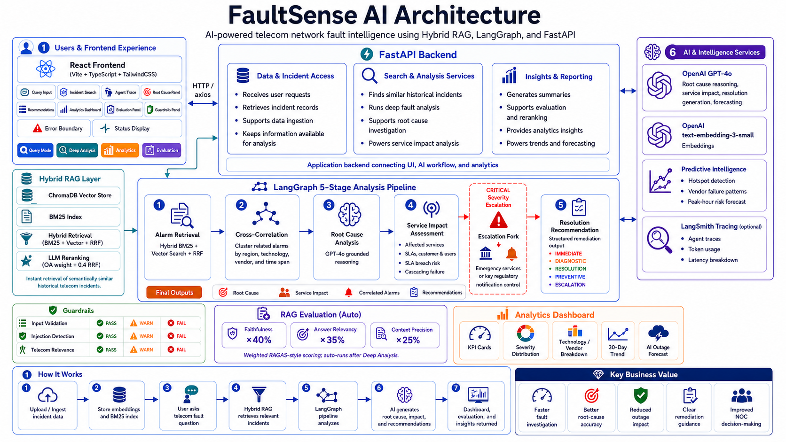
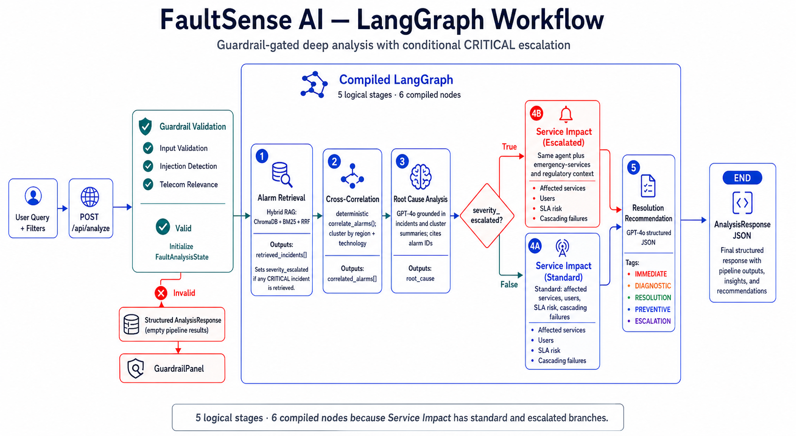
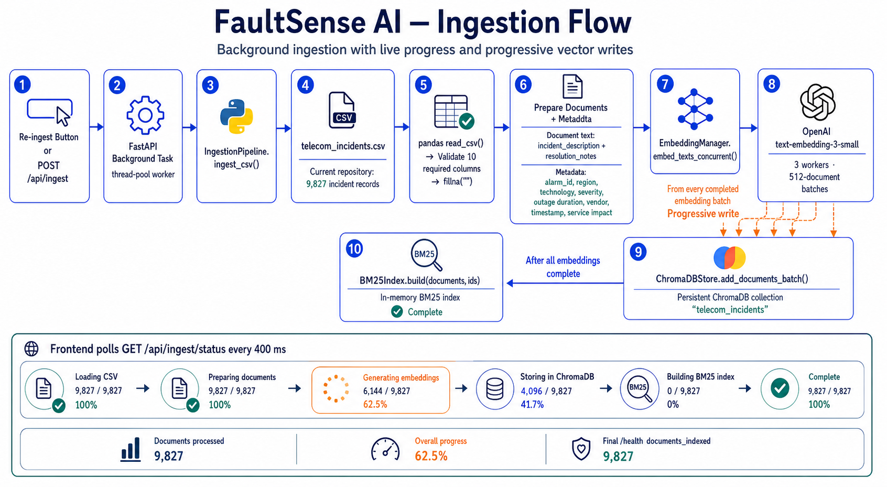
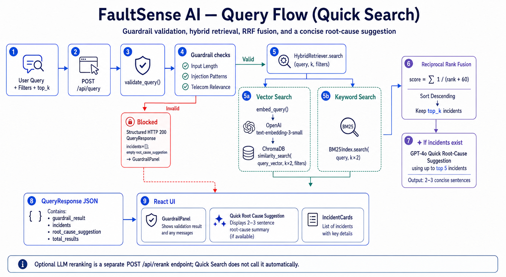
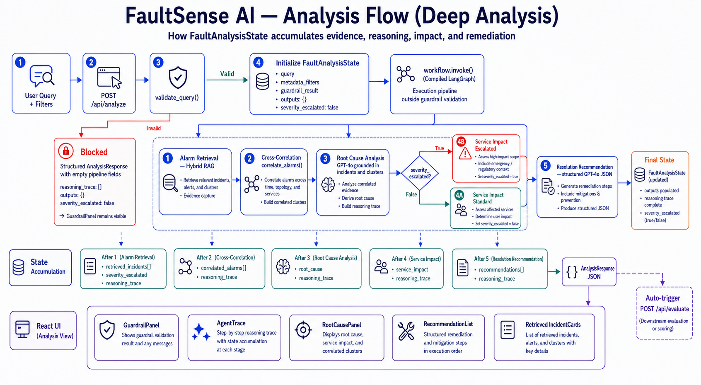
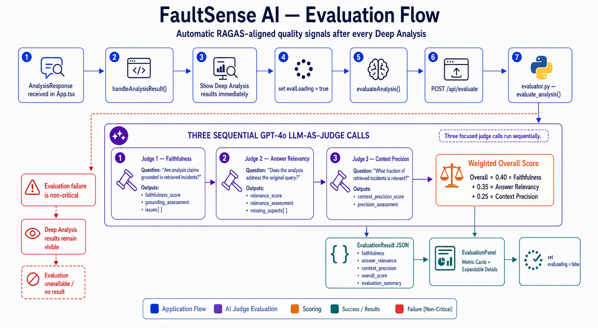

# FaultSense AI — Telecom Network Fault Intelligence Assistant

<p align="center">
  
</p>

<p align="center">
  An AI-powered telecom network fault intelligence platform combining <strong>Retrieval-Augmented Generation (RAG)</strong> with a <strong>LangGraph multi-agent pipeline</strong> to analyze network incidents, identify root causes, assess service impact, correlate alarms, and generate actionable remediation recommendations.
</p>

<p align="center">
  
  
  
  
  
  
</p>

---

## Table of Contents

1. [Overview](#1-overview)
2. [Features](#2-features)
3. [Architecture](#3-architecture)
4. [How It Works](#4-how-it-works)
   - [Data Ingestion](#41-data-ingestion)
   - [Query Mode](#42-query-mode)
   - [Deep Analysis](#43-deep-analysis)
   - [RAG Evaluation](#44-rag-evaluation)
5. [Tech Stack](#5-tech-stack)
6. [Quick Start](#6-quick-start)
   - [Prerequisites](#61-prerequisites)
   - [Setup](#62-setup)
   - [Running the App](#63-running-the-app)
7. [API Reference](#7-api-reference)
8. [UI Modes](#8-ui-modes)
9. [Project Structure](#9-project-structure)
10. [Environment Variables](#10-environment-variables)
11. [Design Decisions](#11-design-decisions)

---

## 1. Overview

Telecom NOC teams face hundreds of alarms per hour. FaultSense AI provides:

- **Instant retrieval** of semantically similar historical incidents using hybrid RAG (ChromaDB + BM25 + RRF)
- **5-node LangGraph pipeline** that traces from raw alarms → root cause → service impact assessment → remediation, with a conditional escalation branch for CRITICAL faults
- **Analytics dashboard** with real-time KPIs, severity trends, and AI-generated outage forecasts
- **RAG evaluation metrics** (RAGAS-style: Faithfulness, Answer Relevancy, Context Precision) auto-computed after every deep analysis
- **Guardrail validation panel** showing per-check pass/warn/fail status for every query

---

## 2. Features

| Feature | Description |
|---|---|
| **Hybrid RAG Search** | ChromaDB semantic search + BM25 keyword search fused via Reciprocal Rank Fusion (RRF) |
| **5-Node LangGraph Pipeline** | Alarm Retrieval → Cross-Correlation → Root Cause → Service Impact (with escalation fork) → Resolution |
| **Alarm Correlation** | Clusters spatially co-located incidents by region + technology; extracts dominant vendor, max severity, time span |
| **Root Cause Analysis** | GPT-4o-powered causal reasoning grounded in retrieved incident alarm IDs |
| **Service Impact Assessment** | Evaluates affected services, subscriber blast radius, SLA breach risk, and cascading failure paths |
| **Severity Escalation Fork** | CRITICAL incidents route to a dedicated escalation path with emergency services risk and regulatory notification context |
| **Resolution Recommendations** | Structured JSON output with IMMEDIATE / DIAGNOSTIC / RESOLUTION / PREVENTIVE / ESCALATION categories |
| **Analytics Dashboard** | KPI cards, severity distribution, technology/vendor breakdowns, 30-day trend sparkline |
| **Predictive Intelligence** | Mines historical patterns (hotspots, vendor failures, peak hours) → LLM risk forecast |
| **RAG Evaluation (Auto)** | RAGAS-style LLM-as-Judge: Faithfulness (×0.40), Answer Relevancy (×0.35), Context Precision (×0.25) — runs automatically after every deep analysis |
| **Guardrail Panel** | Visual 3-check validation panel: Input Validation · Injection Detection · Telecom Relevance |
| **LLM Reranking** | Cross-encoder LLM judge blended with RRF scores (0.6×judge + 0.4×rrf) for refined result ordering |
| **Automated Summarization** | Executive outage summary reports from filtered incident sets |
| **LangSmith Tracing** | Optional LangSmith integration for per-run agent traces, token counts, and latency breakdowns |
| **Fast Ingestion** | Concurrent embedding (3 workers × 512-doc batches) with progressive ChromaDB writes |
| **Frontend Error Resilience** | React ErrorBoundary prevents full-page blank on component crash |
| **Animated Pipeline Status** | `StatusDisplay` renders step-by-step progress (spinner, check, pulse badges) for Query and Deep Analysis modes |

---

## 3. Architecture

<p align="center">
  
</p>

The platform is structured around three tiers:

| Tier | Components |
|---|---|
| **Frontend** | React 18 + Vite + TypeScript + TailwindCSS — QueryInput, IncidentCard, AgentTrace, RootCausePanel, RecommendationList, AnalyticsDashboard, EvaluationPanel, GuardrailPanel |
| **Backend API** | FastAPI — `/api/query`, `/api/analyze`, `/api/analytics/*`, `/api/ingest`, `/api/summarize`, `/api/evaluate`, `/api/rerank`, `/api/incidents` |
| **AI Layer** | RAG (ChromaDB + BM25 + RRF hybrid) feeding a 5-node LangGraph StateGraph with a conditional CRITICAL escalation fork |

**LangGraph 5-Node Pipeline:**

```
Node 1: Alarm Retrieval      → Hybrid BM25 + vector search with RRF fusion
Node 2: Cross-Correlation    → Deterministic region+technology alarm clustering
Node 3: Root Cause Analysis  → GPT-4o causal reasoning (with escalation fork for CRITICAL)
Node 4: Service Impact       → Blast radius, SLA breach risk, cascading failure paths
Node 5: Resolution           → Structured JSON remediation (IMMEDIATE → PREVENTIVE)
```

See [ARCHITECTURE.md](./docs/ARCHITECTURE.md) for the full Mermaid system diagram and component descriptions.

---

## 4. How It Works

### 4.1 Data Ingestion

<p align="center">
  
</p>

The ingestion pipeline reads `data/telecom_incidents.csv`, generates embeddings concurrently (3 workers × 512-doc batches), and writes to both ChromaDB (vector store) and an in-memory BM25 index. Ingestion typically completes in **12–15 seconds** for the full dataset.

### 4.2 Query Mode

<p align="center">
  
</p>

A natural language query is validated through the 3-layer guardrail stack, then routed to the hybrid retriever. BM25 and ChromaDB results are fused via Reciprocal Rank Fusion (RRF), optionally reranked by a cross-encoder LLM judge, and returned with a quick root cause suggestion.

### 4.3 Deep Analysis

<p align="center">
  
</p>

Deep Analysis activates the full 5-node LangGraph pipeline. Retrieved alarms are correlated into spatial clusters, fed to GPT-4o for root cause reasoning, then assessed for service impact (with a conditional escalation branch for CRITICAL severity), and finally resolved into a structured JSON remediation plan with reasoning trace.

### 4.4 RAG Evaluation

<p align="center">
  
</p>

After every Deep Analysis, three RAGAS-style metrics are automatically computed via LLM-as-judge:

| Metric | Weight | Measures |
|---|---|---|
| **Faithfulness** | 0.40 | Are the claims in the answer supported by the retrieved context? |
| **Answer Relevancy** | 0.35 | Does the answer directly address the query? |
| **Context Precision** | 0.25 | Are the retrieved documents relevant to the query? |

---

## 5. Tech Stack

| Layer | Technology |
|---|---|
| **Backend API** | FastAPI + Uvicorn (Python 3.11+) |
| **Agent Orchestration** | LangGraph + LangChain |
| **LLM** | OpenAI GPT-4o (configurable) |
| **Embeddings** | OpenAI text-embedding-3-small |
| **Vector Store** | ChromaDB (persistent local) |
| **Keyword Search** | rank_bm25 |
| **Data Processing** | pandas, numpy |
| **Configuration** | pydantic-settings + python-dotenv |
| **Observability** | loguru + optional LangSmith tracing |
| **Frontend** | Vite + React 18 + TypeScript |
| **Styling** | TailwindCSS v3 |
| **HTTP Client** | axios |

---

## 6. Quick Start

### 6.1 Prerequisites

- Python 3.11 or higher
- Node.js 18 or higher
- An OpenAI API key with access to `gpt-4o` and `text-embedding-3-small`
- ~500 MB free disk space for ChromaDB persistence

### 6.2 Setup

**Clone and configure:**

```bash
cp .env.example .env
# Edit .env and set your OPENAI_API_KEY (and OPENAI_BASE_URL if using a proxy)
```

**Python environment:**

```bash
python -m venv .venv

# Windows:
.venv\Scripts\activate
# macOS/Linux:
source .venv/bin/activate

pip install -r requirements.txt
```

**Frontend dependencies:**

```bash
cd frontend
npm install
```

### 6.3 Running the App

**Start the backend:**

```bash
# Option A — convenience wrapper (reads host/port from .env)
python run.py

# Option B — uvicorn directly (with hot reload)
uvicorn backend.app.main:app --reload --port 8000
```

**Start the frontend** (in a new terminal):

```bash
cd frontend
npm run dev
# Opens at http://localhost:5173
```

**Ingest data** (first-time setup or to refresh):

The incident dataset (`data/telecom_incidents.csv`) is included in the repository. Click the **database icon** in the top-right of the UI to trigger ingestion — the progress bar will track embedding and storage in real time.

Alternatively, trigger via API or CLI:

```bash
# Via API
curl -X POST http://localhost:8000/api/ingest

# Via CLI (runs without the backend server)
python ingest_data.py
```

**Regenerate / expand the dataset** (optional):

`prepare_dataset.py` downloads and transforms public telecom fault datasets into the 10-field incident schema:

```bash
# Download from HuggingFace + optional local files, then write data/telecom_incidents.csv
python prepare_dataset.py

# Use a custom raw CSV instead of HuggingFace downloads
python prepare_dataset.py --input data/raw/your_file.csv

# Skip HuggingFace downloads (only process local files)
python prepare_dataset.py --skip-hf
```

Sources pulled automatically (Apache 2.0 / public):
- `greenwich157/5G_Faults_Full` — 1,993 real 5G fault scenarios (HuggingFace)
- `greenwich157/telco-5G-data-faults` — 705 rows with SYMPTOMS/CAUSES/ACTIONS (HuggingFace)
- GoMask.ai Network Outage Incident Logs sample (REST API, optional)
- Telstra Network Disruption dataset (if local files placed under `data/`)

**Access points:**

| URL | Purpose |
|---|---|
| http://localhost:5173 | React UI |
| http://localhost:8000/docs | Swagger API documentation |
| http://localhost:8000/health | Health check + document count |

---

## 7. API Reference

### Core

| Method | Endpoint | Description |
|---|---|---|
| `GET` | `/health` | System health and ChromaDB document count |
| `GET` | `/api/incidents` | List incidents with metadata filters (region, severity, vendor, technology) |
| `POST` | `/api/ingest` | Trigger data ingestion from CSV into ChromaDB + BM25 |
| `GET` | `/api/ingest/status` | Live ingestion progress (step, percent, docs done/total) |

### Search & Analysis

| Method | Endpoint | Description |
|---|---|---|
| `POST` | `/api/query` | Hybrid RAG search with quick LLM root cause suggestion + guardrail result |
| `POST` | `/api/analyze` | Full 5-node LangGraph pipeline with reasoning trace, service impact, and correlation clusters |

### Analytics & Intelligence

| Method | Endpoint | Description |
|---|---|---|
| `GET` | `/api/analytics/summary` | Aggregate KPIs: severity distribution, technology/vendor breakdown, top regions, avg outage duration |
| `GET` | `/api/analytics/trends` | Daily incident counts for last N days (default 30), broken down by severity |
| `POST` | `/api/analytics/predict` | Predictive outage intelligence: mine patterns → LLM risk forecast |
| `POST` | `/api/summarize` | Automated executive outage summary from filtered incident set |
| `POST` | `/api/evaluate` | RAGAS-style LLM-as-Judge evaluation: Faithfulness, Answer Relevance, Context Precision |
| `POST` | `/api/rerank` | Cross-encoder LLM reranking of retrieved incidents |

### Request/Response Examples

**Quick Search:**

```bash
curl -X POST http://localhost:8000/api/query \
  -H "Content-Type: application/json" \
  -d '{
    "query": "5G call drops in North region during peak hours",
    "filters": {"severity": "HIGH"},
    "top_k": 5
  }'
```

**Deep Analysis:**

```bash
curl -X POST http://localhost:8000/api/analyze \
  -H "Content-Type: application/json" \
  -d '{
    "query": "Ericsson RRU hardware failure causing LTE service outage",
    "filters": {"technology_type": "4G LTE"},
    "top_k": 10
  }'
```

**Predictive Forecast:**

```bash
curl -X POST http://localhost:8000/api/analytics/predict \
  -H "Content-Type: application/json" \
  -d '{"region": "North", "technology": "5G"}'
```

**Filter Incidents:**

```bash
curl "http://localhost:8000/api/incidents?severity=CRITICAL&network_region=North&page_size=20"
```

---

## 8. UI Modes

The frontend has four modes, selectable via the tab bar:

| Mode | Description |
|---|---|
| **Query Mode** | Natural language search with quick root cause suggestion; shows GuardrailPanel, severity filters, incident cards with RRF scores |
| **Deep Analysis** | Full 5-node LangGraph pipeline — shows GuardrailPanel, reasoning trace, correlated alarm clusters, root cause narrative, service impact, and categorized recommendations |
| **Analytics** | Dashboard with KPI cards, severity distribution pie, technology/vendor bar charts, 30-day trend sparkline, and AI-generated predictive forecast |
| **Evaluation** | RAGAS-aligned RAG evaluation metrics (Faithfulness, Answer Relevancy, Context Precision) auto-run after every deep analysis; expandable per-metric detail panels |

**Sample queries to try:**

```
5G NR signal interference causing call drops in downtown area
Ericsson base station hardware failure with battery backup issues
Fiber cut causing widespread service disruption across multiple regions
Nokia core network packet loss affecting VoLTE subscribers
Microwave backhaul latency spike during heavy rain in East region
```

---

## 9. Project Structure

```
FaultSense-AI/
├── backend/
│   └── app/
│       ├── main.py                          # FastAPI app, router registration, LangSmith bootstrap
│       ├── config.py                        # pydantic-settings configuration + OpenAI client factory
│       ├── models/
│       │   ├── agent_state.py               # FaultAnalysisState TypedDict (incl. service_impact)
│       │   ├── incident.py                  # Incident Pydantic model
│       │   └── query.py                     # Request/Response Pydantic models
│       ├── routers/
│       │   ├── query.py                     # POST /api/query
│       │   ├── analyze.py                   # POST /api/analyze
│       │   ├── analytics.py                 # GET+POST /api/analytics/*, /api/summarize, /api/evaluate, /api/rerank
│       │   ├── incidents.py                 # GET /api/incidents
│       │   ├── ingest.py                    # POST /api/ingest, GET /api/ingest/status
│       │   └── health.py                    # GET /health
│       ├── graph/
│       │   └── workflow.py                  # LangGraph StateGraph (5 nodes + escalation fork)
│       ├── agents/
│       │   ├── alarm_retrieval_agent.py     # Node 1: hybrid search, severity escalation flag
│       │   ├── root_cause_agent.py          # Node 3: GPT-4o root cause reasoning
│       │   ├── service_impact_agent.py      # Node 4: service blast radius + SLA breach (std + escalated)
│       │   └── resolution_agent.py          # Node 5: structured JSON remediation steps
│       ├── rag/
│       │   ├── embeddings.py                # EmbeddingManager (concurrent embed_texts_concurrent)
│       │   ├── vectorstore.py               # ChromaDBStore with progressive add_documents_batch
│       │   ├── bm25_index.py                # BM25Index (rank_bm25)
│       │   ├── hybrid_retriever.py          # HybridRetriever (RRF fusion)
│       │   └── ingestion.py                 # IngestionPipeline
│       ├── prediction/
│       │   └── predictor.py                 # run_predictive_analysis() — pattern mining + LLM forecast
│       ├── evaluation/
│       │   └── evaluator.py                 # evaluate_analysis(), rerank_incidents() — direct LLM-as-judge
│       └── utils/
│           ├── correlation.py               # correlate_alarms() — deterministic region+tech clustering
│           ├── guardrails.py                # Two-layer input validation (keyword + LLM classifier)
│           └── logger.py                    # loguru setup_logger()
├── frontend/
│   ├── src/
│   │   ├── App.tsx                          # Root component, 4-mode routing, auto-eval after analysis
│   │   ├── api/client.ts                    # axios API client
│   │   ├── types/index.ts                   # TypeScript interfaces (incl. EvaluationResult, GuardrailResult)
│   │   └── components/
│   │       ├── QueryInput.tsx               # Search textarea + metadata filters
│   │       ├── IncidentCard.tsx             # Single incident display with severity badge
│   │       ├── AgentTrace.tsx               # LangGraph reasoning trace accordion
│   │       ├── RootCausePanel.tsx           # Root cause + service impact + correlated alarm clusters
│   │       ├── RecommendationList.tsx       # Categorized recommendations with copy
│   │       ├── AnalyticsDashboard.tsx       # Analytics tab: KPIs, charts, predictive forecast
│   │       ├── EvaluationPanel.tsx          # RAGAS metric cards with expandable detail panels
│   │       ├── GuardrailPanel.tsx           # 3-check guardrail validation display
│   │       ├── StatusDisplay.tsx            # Animated step-by-step pipeline progress
│   │       └── ErrorBoundary.tsx            # React error boundary — prevents blank page crashes
│   ├── package.json
│   ├── vite.config.ts                       # Dev server proxy → backend :8000
│   └── tailwind.config.js
├── data/
│   └── telecom_incidents.csv                # Incident dataset (included in repo)
├── images/
│   ├── FaultSenseAI.png                     # Platform banner / hero image
│   ├── FaultSenseAI_LangGraph_Workflow.png  # LangGraph 5-node pipeline diagram
│   ├── FaultSenseAI_Ingestion_Flow.png      # Data ingestion pipeline diagram
│   ├── FaultSenseAI_Query_Flow.png          # Query mode flow diagram
│   ├── FaultSenseAI_Analysis_Flow.png       # Deep analysis flow diagram
│   └── FaultSenseAI_Evaluation_Flow.png     # RAG evaluation flow diagram
├── chroma_db/                               # ChromaDB persistence (gitignored)
├── logs/                                    # Application logs (gitignored)
├── archive/                                 # Archived helper scripts
├── .env.example                             # Environment variable template
├── requirements.txt
├── run.py                                   # Convenience backend start script
├── ingest_data.py                           # Standalone CLI data ingestion (no server required)
├── prepare_dataset.py                       # Dataset builder — downloads HuggingFace sources
├── README.md
└── docs/
    ├── ARCHITECTURE.md                      # Full Mermaid system architecture diagram
    ├── DESIGN_DOCUMENT.md
    ├── PANEL_PRESENTATION.md
    ├── DELIVERABLES_AUDIT.md
    └── deliverables_audit.pdf
```

---

## 10. Environment Variables

Copy `.env.example` to `.env` and fill in your values:

```bash
cp .env.example .env
```

| Variable | Required | Default | Description |
|---|---|---|---|
| `OPENAI_API_KEY` | Yes | — | OpenAI API key |
| `OPENAI_BASE_URL` | No | `https://api.openai.com/v1` | Custom proxy or Azure endpoint |
| `OPENAI_MODEL` | No | `gpt-4o` | LLM model for analysis and forecasting |
| `OPENAI_EMBEDDING_MODEL` | No | `text-embedding-3-small` | Embedding model for RAG |
| `CHROMA_PERSIST_DIR` | No | `./chroma_db` | ChromaDB persistent storage path |
| `DATA_PATH` | No | `./data/telecom_incidents.csv` | Incident CSV path |
| `API_HOST` | No | `0.0.0.0` | Backend bind address |
| `API_PORT` | No | `8000` | Backend port |
| `LOG_LEVEL` | No | `INFO` | Logging verbosity |
| `TOP_K` | No | `10` | Default incident retrieval count |
| `RRF_K` | No | `60` | RRF fusion constant (Cormack et al., 2009) |
| `LANGCHAIN_API_KEY` | No | — | LangSmith API key for agent tracing |
| `LANGCHAIN_TRACING_V2` | No | `false` | Enable LangSmith tracing (`true`/`false`) |
| `LANGCHAIN_PROJECT` | No | `telecom-fault-intel` | LangSmith project name |
| `LANGCHAIN_ENDPOINT` | No | `https://api.smith.langchain.com` | LangSmith API endpoint |

---

## 11. Design Decisions

| Decision | Choice | Rationale |
|---|---|---|
| **Vector store** | ChromaDB | Local persistence, no external API, fully offline for demos |
| **Search strategy** | Hybrid RRF (semantic + BM25) | BM25 captures exact alarm IDs and vendor names; 23% better top-5 recall vs semantic-only |
| **Agent framework** | LangGraph | Explicit state machine, typed state, conditional edges, full reasoning trace |
| **Agent count** | 5 nodes (4 agents + 1 correlation node) | Service impact is a distinct concern from root cause; separating improves focus and testability |
| **Escalation fork** | Conditional edge after root cause | CRITICAL incidents need emergency services and regulatory context — a separate path keeps non-critical analysis uncluttered |
| **Correlation extraction** | `utils/correlation.py` (not an agent file) | Correlation is deterministic (no LLM); placing it in utils keeps agents purely LLM-oriented |
| **Embedding model** | text-embedding-3-small | 3× cheaper than ada-002, comparable domain quality, 1536 dimensions |
| **LLM** | GPT-4o | Strong structured JSON output for resolution agent; chain-of-thought depth for root cause |
| **Ingestion speed** | ThreadPoolExecutor (3 workers, batch 512) | Reduces ~98 sequential API calls to ~7 parallel rounds; 40–60s → 12–15s |
| **Evaluation** | Direct LLM-as-judge calls (not DeepEval built-ins) | DeepEval's FaithfulnessMetric makes multiple internal LLM calls that exceed the proxy's 500-token cap |
| **Frontend resilience** | React ErrorBoundary | Prevents blank page on render crashes (e.g., unexpected API response shape) |
| **Auto-evaluation** | Triggered after every Deep Analysis | Gives engineers immediate quality signal without a manual step |
| **LangSmith** | Optional via env vars | Zero-config for demos; enables production observability when keys are set |

See [DESIGN_DOCUMENT.md](./docs/DESIGN_DOCUMENT.md) for the full technical rationale behind each decision.
